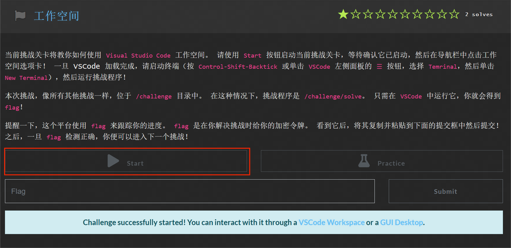

# pwn.hust.college 平台用户使用指南

# 一、 概述

pwn.hust.college 平台用于实践网络空间安全，旨在最小化学生和教师的障碍。道馆借鉴了 Capture The Flag（CTF）社区的见解和灵感，该社区开创了使用实践挑战来教授网络空间安全概念的方式。道馆通过提供一个预配置的、功能齐全的学习环境来改进现有平台的可访问性和易用性，该环境可以从任何设备的浏览器进行访问。学生能够在浏览器中编写代码、与 shell 交互、探索复杂的网络配置、调试进程和内核模块等。教师可以轻松地将道馆部署到自己的服务器上，使用单个 docker 运行命令，并通过 git 仓库来管理挑战关卡。

道馆巧妙地融入了神奇宝贝世界的元素，将各类题目按照课程知识点知识点分门别类，安置于独特的道馆之中。每一个道馆都由具有独特能力的宝可梦充当挑战关卡守护者，尊重了原作的设定。学生们化身为一个个青年神奇宝贝训练家，追随着小智的步伐，踏上夺取勋章的征程，挑战各个道馆，攻克难关。对于成功通过道馆考验的学生，本网站将颁发与游戏中一比一的纪念徽章，这一独特设计将极大地提升了同学们的学习热情与动力，为成为一位 Master of PWN（神奇宝贝大师）而不断奋斗。

## 1.1 背景

软件开发领域利用容器化技术确保环境可移植性和可重现性,开发者也采用容器化开发环境标准化工作流程。教育领域效仿此做法,集成容器化学习环境,为初学者提供预配置环境,避免环境配置阻碍学习。网络空间安全等领域亟需此类创新教学模式,解决实操经验缺乏及师资短缺问题。

本指南将介绍“神奇宝贝道馆“平台，这是一个专为网络空间安全设计的平台，灵感来源于广受欢迎的网络安全竞赛形式——夺旗赛(Capture The Flag， CTF)。CTF 竞赛已被证明是教授网络空间安全概念的有效方法，学生通过解决一系列富有挑战性的任务来获取**“****旗帜****(flag)”**，以此来验证自己掌握了新技能。“道馆”平台让学生可以直接在浏览器中访问预配置的学习环境，进行代码编写、网络配置探索、进程调试等实践活动，无需在本地机器上进行繁琐的环境配置。这种沉浸式的学习体验将极大地提高学生的学习兴趣和效率。

本文将在接下来的章节中详细阐述**道馆**平台的设计理念、系统架构和实现细节，展示其如何应用容器化技术，为网络空间安全教育带来全新的学习模式。通过**道馆**平台，我们希望为网络空间安全人才的培养提供一个高效、灵活、有趣的学习环境，助力网络空间安全教育事业的发展。

## 1.2 总体设计

在设计“道馆”平台时，我们的首要任务是最大限度地简化学生访问挑战关卡和教师部署挑战关卡的难度。在这个过程中，我们利用了许多现有的技术，着重于实现平滑集成。“道馆“从网络空间安全竞赛，特别是夺旗赛(Capture The Flag， CTF)中汲取灵感，并扩展这些理念以实现我们的目标：让更多人能够接受网络空间安全教育。

### 1.2.1  挑战环境

"道馆"显著扩展了 CTFd 框架的功能，CTFd 是一个流行的平台，用于举办简单的一次性"Capture The Flag" (CTF)安全竞赛。CTFd 处理用户账户管理、追踪答案提交，并提供列出挑战关卡和展示成绩排行榜的基础网页界面。"道馆"在此基础上增加了功能，创造了一个为学生提供持续、全面学习体验的环境。

在标准的 CTF 竞赛中，参与者通常会得到一个可下载的挑战程序，或是如何与远程运行的挑战关卡进行通信的指示(例如，使用 `nc` 命令)。我们在此基础上进行扩展，为学生提供了一个专用的容器化环境。学生可以在准备好解决挑战关卡时启动这个环境，一旦启动，容器中就包含了挑战本身和任何其他必要的文件。此外，我们也开源了我们的挑战关卡题目，有时还会通过开放题目源码来降低学生负担。

### 1.2.2 工作环境

#### 广泛的工具支持

学生在托管挑战关卡的同一环境中完成实践。这些容器预先配置了必要的安全工具。目前，“道馆”的默认挑战环境配备了 ipython、tmux、strace、gdb、pwntools、pwndbg、gef、radare2、ghidra、wireshark、nmap、scapy、requests、curl 等多种工具。我们的目标是让学生能够直接在“道馆“环境中执行解决挑战关卡的每个步骤——漏洞发现、利用代码实现和调试。

“道馆”平台通过提供一个集成了各种常用工具的统一环境，免去了学生在本地机器上安装和配置工具的繁琐过程，让他们可以专注于学习网络空间安全技能本身。同时，这也确保了学生在解决挑战关卡时拥有一致的工作环境，减少了由于环境差异导致的问题，提高了学习效率。

### 1.2.3 环境访问

学生可通过三种方式访问他们的挑战环境。此外，我们还会讲述一些“道馆”平台的特色。

#### SSH 访问

第一种方式是通过在道馆网页界面上传公钥，利用 SSH 进入挑战关卡，并使用 SCP 进行文件传输。

#### Visual Studio Code

第二种方式是通过道馆内运行的 Visual Studio Code，提供文本编辑器（包括文件上传和下载）、命令行终端、文件管理和插件接口。

#### 浏览器内桌面环境

第三种方式是浏览器内桌面环境，为学生提供在浏览器内运行任意图形界面程序的能力，适用于软件逆向等高级安全课程。这种全浏览器体验消除了硬件进入障碍，适用于笔记本电脑、平板电脑或其他移动设备。

#### 特权模式

此外，道馆还提供特权模式。在此模式下，学生在类似标准模式的环境中工作，但拥有 sudo 权限和占位符标志。通过此根访问权限，学生可全面分析和调试依赖标志访问的挑战程序，同时不泄露实际 flag，确保挑战完整性。

#### 持久化家目录

另外，为了在切换 challenge 和挑战时提高可用性，道馆在所有挑战环境中保持挑战环境的家目录持久化。这种持久化家目录的设计至关重要，因为它使学生能够存储他们之前的解决方案（用于参考和扩展）以及自定义脚本和工具。关键的是，家目录是以 `nosuid` 选项挂载的，这阻止了学生在不同环境之间传递 root-owned SUID 二进制文件。

### 1.2.4 挑战虚拟化

尽管 Docker 在许多挑战场景下表现出色，但它并非总能提供某些特定挑战所需的全部功能。例如，标准的非特权容器无法任意管理网络资源，这限制了网络空间安全教育的范围。为了解决这些限制，道馆提供了两种解决方案:用户命名空间和虚拟机。

#### 用户命名空间

道馆支持嵌套命名空间虚拟化，使挑战能够创建任意网络拓扑、进程隔离和权限模型。这需要道馆修改 Docker 的 seccomp 过滤器，允许相关系统调用(如 unshare)，并创建用户命名空间，从而将必要的 Linux 功能授予挑战关卡，同时不影响道馆系统的整体安全。

#### 虚拟机

对于无法仅通过命名空间虚拟化解决的挑战类型，道馆支持在用户容器内使用虚拟机和系统模拟器。我们的虚拟机实现能够透明地与容器共享文件系统，这意味着文件在容器和虚拟机之间自动共享，且一个环境中的修改将立即反映在另一个环境中。这种方式消除了将解决方案和调试代码传输到传统最小化环境(运行在易受攻击的内核中)的障碍。

### 1.2.5 教师功能

#### 环境共享

道馆拥有一个独特的双向信息共享功能。教师可以将自己的桌面环境广播给学生，让他们实时观察教师的操作。反之，教师也可以访问并与学生的桌面环境互动，或通过 SSH 连接到学生的环境中。通过这种方式，教师能够直接了解学生解决问题的思路，无论是实时观察还是事后检查他们的解决方案脚本。这在混合或在线课程中尤为实用，可以更好地指导学生攻克复杂问题。值得注意的是，教师访问学生环境的权限在课程开始时均会向学生明确告知。

#### 反作弊机制

为防止学生共享挑战标志，道馆为每个用户和挑战生成了单独加密的标志。这使得道馆能够验证某个标志是否对特定用户和挑战是正确的，并自动检测学生间的标志共享行为。此外，教师可以为同一挑战指定多个细微变体，每个学生将被随机分配其中一个，从而增加了学生间解决方案共享的难度，要求他们开发出专门针对自身挑战的解决方案。

#### 自动评分

为方便教师管理大规模学生课程，道馆支持自动评分功能。它能导出学生在每个挑战上的详细进度统计数据，供教师确定成绩并了解学生的时间投入情况。结合查看学生桌面和访问学生文件的能力，教师可以轻松掌握班级整体进度，识别遇到困难的学生以及发现作弊行为。

总的来说，道馆的设计理念是提供一个全面且易于使用的平台，不仅能提高学生的学习效率，还能让教师更高效地管理和指导学生。通过这些精心设计的功能，使之更加高效且易于接受和使用。


# 二、学生手册

欢迎来到 [pwn.hust.college](https://pwn.cse.hust.edu.cn/) ，一个基于神奇宝贝动画设计的趣味教育平台。为助您获取 flag，成功闯关，下面将介绍道馆的注册、登录、使用细则，以及 vscode 工作空间，图形桌面工作空间，SSH 这三种与挑战关卡互动的方式。

## 2.1 道馆

### 2.1.1 注册以及登录

我们平台接入了智慧华中大统一身份认证,因此并不需要注册账号，可以直接进行登录。

我们点击右上角统一身份认证，跳转到[智慧华中大](https://pass.hust.edu.cn/cas/login)。


输入自己的账号密码之后，会自动跳转 `DOJO`，即可成功登录平台。


### 2.1.2  道馆使用细则

可以看到道馆有入门篇、初级篇、中级篇、高级篇，难度依次递增，只有完成入门篇 8 个关卡，拿到徽章才能进入后续篇章的学习。我们以入门篇为例说明道馆的使用细则：

点击**入门篇**，可以看到道馆简介，道馆奖项，道馆状态，道馆模块以及道馆排名，点击道馆模块。


进入道馆模块后可以看到篇章内容简介，课程讲解与资料学习，和挑战关卡。完成每个挑战关卡后都可以获得相应的 flag，全部完成后即可获得徽章。

开始挑战，点击名为工作空间的第一关：


点击 Start 按钮，当出现下方蓝色提示时意味着当前挑战关卡已经启动。



## 2.2 VSCode 工作空间

### 2.2.1 工作空间

根据简介第一关将教你如何让使用 Visual Studio Code 工作空间，点击上方的工作空间或者下方蓝色提示中的 Vscode Workspace 均可进入。


进入工作空间后，根据提示要运行路径为/challenge/solve 的挑战程序。

如果当前处在/home 目录中，请切换文件夹至/challenge 目录中。


填写/challenge，点击 ok 按钮切换。


切换到/challenge 目录下可以看到 DESCRIPTION 里面的提示以及我们需要运行的程序 solve，右键 solve 打开终端。


输入命令。/solve 运行可执行程序，可以获取 flag，复制 flag。


回到道馆，将 flag 粘贴至浅绿色框内，然后点击右侧 submit 提交，如果出现 correct 提示并且旗帜变成绿色说明 flag 正确，闯关成功。（注意：不同同学、每次挑战的 flag 都不一样）


### 2.2.2 读取 flag

运行第四关，打开工作空间，根据提示/flag 文件需要 root 用户才能访问。


先运行可执行文件让所有人都能读取 flag，使用命令 cat /flag 读取 flag。


回到道馆，将 flag 粘贴至浅绿色框内，然后点击右侧 submit 提交，如果出现 correct 提示并且旗帜变成绿色说明 flag 正确，闯关成功。

### 2.2.3 使用练习模式

第五关是使用练习模式获取 sudo 权限读取密钥，然后再在正常模式下运行可执行文件输入密钥，获取 flag。点击 practice 练习模式按钮开启第四关，进入 VSCode 工作空间。


用命令 sudo cat 。/secret 来读取密钥


回到道馆，点击 start 正常模式，进入工作空间，运行可执行文件，输入密钥，获取 flag。


回到道馆，将 flag 粘贴至浅绿色框内，然后点击右侧 submit 提交，如果出现 correct 提示并且旗帜变成绿色说明 flag 正确，闯关成功。

### 2.2.4 持久家目录

在本平台中，你的家目录在挑战关卡之间是保持不变的，可以共享的。 这意味着你可以在多个挑战关卡中使用它来积累笔记、参考旧解决方案，或者重新运行在练习模式中完善的解决方案来应对非练习模式中的挑战关卡。

可以通过打开文件夹，选择 home/hacker 到家目录，家目录在挑战关卡中保持不变，可在其中新建文件、文件夹，具体操作可以通过第六关第七关验证。


## 2.3 图形桌面工作空间

### 2.3.1 桌面

点击 start 按钮开启第二关，点击上方桌面按钮或蓝色提示上的 GUIDesktop 均可进入桌面环境。


进入桌面环境，可以看到 challenge 目录下的 DESCRIPTION 任务描述以及可执行程序 solve，在 challenge 目录下右键打开终端。


输入命令。/solve 运行可执行程序可以得到 flag 以及将 flag 从桌面平台粘贴到宿主机系统的方法。


根据方法打开屏幕左侧的剪切板，勾选 flag 内容，发现剪切板中显示 flag 内容，在剪切板里面复制 flag 内容。


回到道馆，将 flag 粘贴至浅绿色框内，然后点击右侧 submit 提交，如果出现 correct 提示并且旗帜变成绿色说明 flag 正确，闯关成功。

### 2.3.2 桌面拷贝

启动第三关桌面拷贝，复制令牌，在/challenge 目录中打开终端，输入指令。/solve 运行可执行程序，获得能从宿主机拷贝到桌面环境中的方法。


将令牌粘贴至剪贴簿并且复制。


在终端中输入令牌获取 flag，复制 flag 至宿主机参考 2.3.1 的内容。


回到道馆，将 flag 粘贴至浅绿色框内，然后点击右侧 Submit 按钮提交，如果出现 correct 提示并且旗帜变成绿色说明 flag 正确，闯关成功。

## 2.4 SSH

### 2.4.1 SSH

点击 start 按钮开启第八关，通过 SSH，用户可以安全地登录远程计算机，并执行命令、传输文件等操作。下面将演示在 win11 终端通过 ssh 成功获取 flag。

打开终端，通过 cd 进入 `.ssh` 文件夹，输入 `ssh-keygen -f key`（在 win11 终端中，使用空字符串作为参数可能会引起语法错误或不被接受，-N 去掉后输入密码时直接回车表示无密码），生成 key 和 key.pub 公私钥对，通过 cat key.pub 将公钥内容复制出来。


回到道馆点击右上角设置，点击左侧 SSH 公钥。


将复制的公钥填入并且点击 update，出现绿色提示说明公钥成功上传。


回到 Win11 终端，

```
ssh -i ～/.ssh/key -p 22223 hacker@pwn.cse.hust.edu.cn
```

即可连接到挑战关卡容器，切换到 challenge 目录，然后运行挑战程序，获取 flag。


最后回到道馆，将 flag 粘贴至浅绿色框内，然后点击右侧 submit 提交，如果出现 correct 提示并且旗帜变成绿色说明 flag 正确，闯关成功。

## 2.5 KOOK

同学们可以将 kook 个人账号连接到平台中，这样可以通过 pwn.hust.college 平台在 KOOK 频道中做信息广播。

## 2.6 帮助
开启挑战后点击上方的帮助，可开启一个大语言模型交互界面，在输入框中输入与开启的挑战相关的信息并发送，可以获取到相关的帮助信息。


